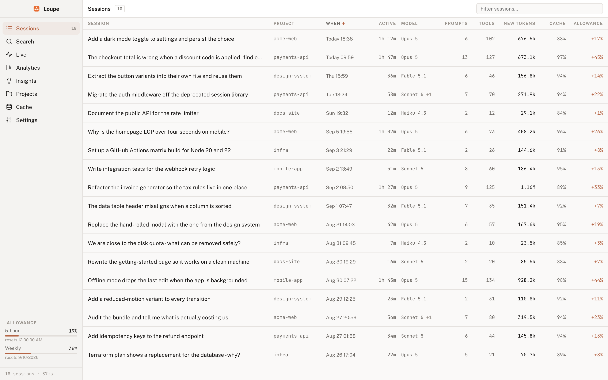

<div align="center">
  
  <h1>Loupe</h1>
  <p><strong>A token inspector for Claude Code - where your context, cache and allowance actually went.</strong></p>
</div>

Loupe reads the transcripts Claude Code already writes to your machine and
explains them. Which session burned the tokens, which file got read eleven
times, where the prompt cache was thrown away and rebuilt, and how much of your
five-hour allowance a piece of work actually cost.

It runs on your machine, never calls a model, and costs nothing to run.



## What it tells you

- **Where the tokens went.** Per session, per project, per file, per tool call.
- **What the cache did.** Every point the cached prefix was discarded and
  rebuilt, split by cause: idle expiry, a mid-session model change, a
  compaction, or a prefix that simply moved as the context grew.
- **What was avoidable.** Findings are fixed sentences with measured numbers in
  them - a file read at full length nine times, a command that failed four times
  running, a turn that spent five times more on thinking than on its answer.
- **What it cost you.** Allowance is read from Anthropic's usage endpoint and
  attributed to the sessions that were running at the time. It is measured,
  never estimated.
- **What is happening right now.** The Live screen follows the running session
  and raises a notification when something unexpectedly expensive happens.

## Download

Grab the latest build from the
[releases page](https://github.com/ashley-hunter/loupe/releases/latest).

| Platform             | File                                     |
| -------------------- | ---------------------------------------- |
| macOS, Apple silicon | `Loupe-<version>-arm64.dmg`              |
| macOS, Intel         | `Loupe-<version>.dmg`                    |
| Windows              | `Loupe-<version>-x64-setup.exe`          |
| Linux                | `Loupe-<version>.AppImage` or the `.deb` |

The `.zip`, `.blockmap` and `latest*.yml` files in a release are for the
updater. You do not need to download them.

### First open

Builds are not code-signed yet, so each OS will object once:

- **macOS**: right-click the app and choose Open, then Open again. Double
  clicking it will not offer the choice.
- **Windows**: SmartScreen appears. Choose More info, then Run anyway.
- **Linux**: `chmod +x Loupe-<version>.AppImage` before running it.

## Updates

An installed build checks the releases page on launch and every six hours, and
downloads a newer version by itself. Installing is not automatic: the new
version is applied the next time you start the app, or immediately from
**Settings → Updates → Restart and install**.

macOS will not install an update to an unsigned build - the system validates the
signature and refuses. Until the certificate is in place, macOS users see the
check fail in Settings and can download the new version by hand. Windows and
Linux update regardless. See [docs/signing.md](docs/signing.md).

## What it reads, and what it never does

Loupe reads two things:

1. `~/.claude/projects`, the JSONL transcripts Claude Code writes. Read only.
   Nothing is ever written back, moved or deleted.
2. Anthropic's OAuth usage endpoint, for the allowance figure, using the token
   Claude Code already stores - the login Keychain on macOS,
   `~/.claude/.credentials.json` elsewhere. It is polled every five minutes.

It never:

- **Calls a model.** Not once, for anything. Every finding is a deterministic
  detector with a hand-written sentence
  ([ADR-0002](docs/adr/0002-the-app-never-calls-a-model.md)). The usage endpoint
  reports consumption without running inference, so **polling costs no tokens
  and no allowance of its own**.
- **Sends your transcripts anywhere.** There is no backend, no telemetry and no
  account. The only outbound requests are the usage endpoint and, for updates,
  the GitHub releases page.
- **Estimates.** A session that ran before you installed Loupe has no allowance
  reading, so its allowance is blank rather than guessed
  ([ADR-0001](docs/adr/0001-allowance-is-measured-never-estimated.md)).

## The screens

**Sessions** lists every session with its active time, models, new tokens, cache
hit rate and measured allowance. Opening one gives a timeline of every event,
with what each added to the context.


**Insights** groups avoidable cost by category and tells you what to do about
each. Every number is measured from your own transcripts.


**Analytics** covers new tokens, cache hit rate and allowance over time. Days
with no sessions are drawn as gaps rather than zeroes, and each scale covers
only the range actually reached.


**Cache** breaks down every invalidation by cause and cost, separating the
avoidable ones from idle expiry and compaction - neither of which is a mistake.
**Projects** rolls the same figures up per repository. **Live** follows the
running session. **Search** (⌘F) looks across every transcript; ⌘K opens a
command palette.

## Requirements

- Claude Code, with at least one session recorded under `~/.claude/projects`.
- macOS, Windows or Linux. The macOS minimum is whatever Electron 44 requires.

There is no database and no setup. The first launch parses everything it finds -
1.68 GB of transcripts takes about 3.5 seconds
([ADR-0003](docs/adr/0003-no-database.md)) - and caches the result so later
launches are instant.

## Building from source

Node 22 or newer.

```sh
npm install
npm run dev      # vite dev server plus electron
npm start        # build and run the packaged main process
npm run check    # typecheck, lint, format check, tests
npm run dmg      # an unsigned macOS dmg in release/
npm run dist:all # macOS, Windows and Linux
```

### Working with fake data

Screenshots and demos should not contain real prompts. `LOUPE_ROOT` points the
app at a different transcript directory, and moves the index cache and allowance
series with it, so a demo run touches nothing real and never calls the usage
endpoint:

```sh
node scripts/demo-data.mjs /tmp/loupe-demo
LOUPE_ROOT=/tmp/loupe-demo npm start
```

Every image in this README was taken that way.

## How it works

The decisions worth knowing about are written down:

- [Allowance is measured, never estimated](docs/adr/0001-allowance-is-measured-never-estimated.md)
- [The app never calls a model](docs/adr/0002-the-app-never-calls-a-model.md)
- [No database](docs/adr/0003-no-database.md)
- [Updates come from GitHub releases](docs/adr/0004-updates-come-from-github-releases.md)

[CONTEXT.md](CONTEXT.md) defines the vocabulary the code and the interface both
use - session, request, block, allowance, invalidation and the rest.
[PLAN.md](PLAN.md) records what the real transcripts turned out to support, and
the places that forced a change to the original design.

## Licence

MIT. See [LICENSE](LICENSE).
