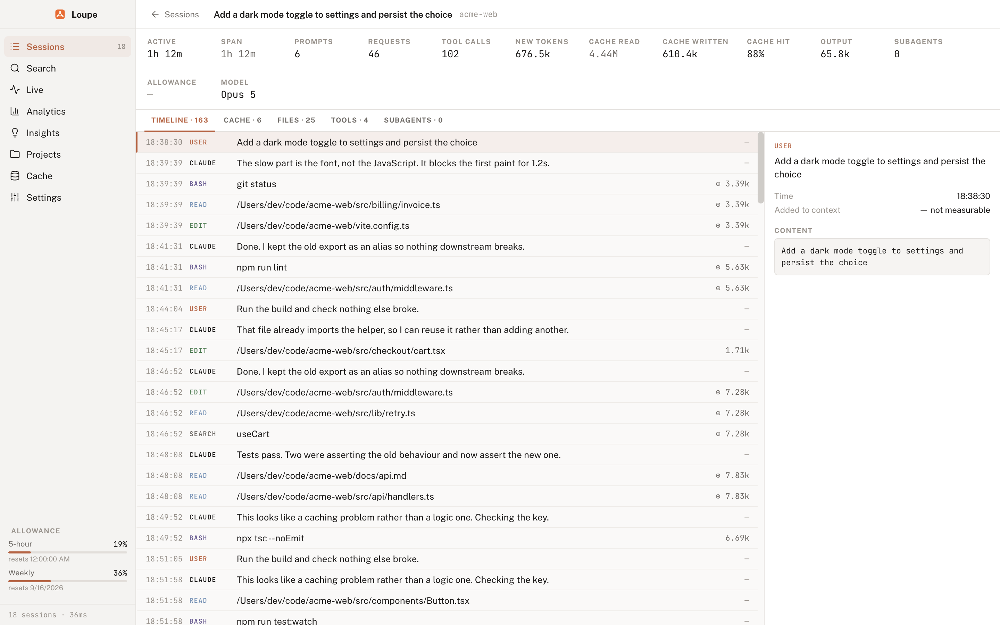
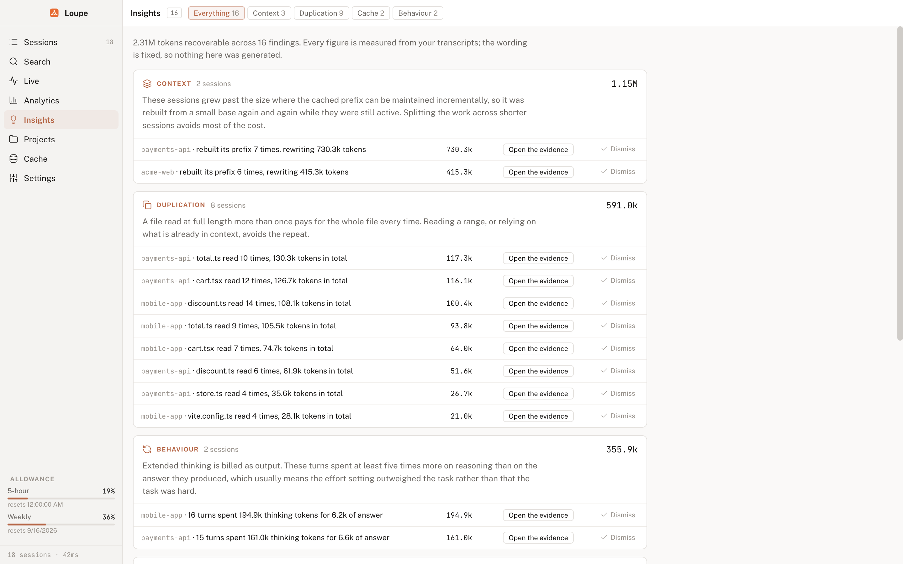
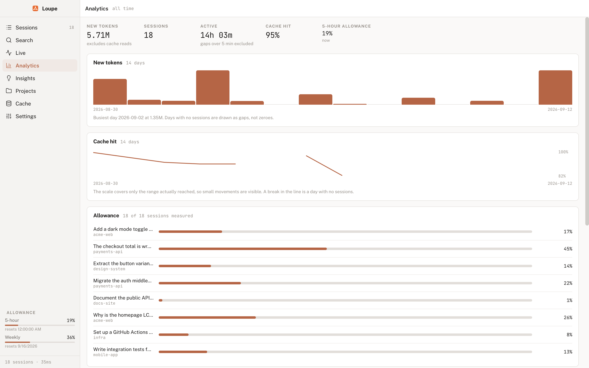

<div align="center">
  
  <h1>Loupe</h1>
  <p><strong>A token inspector for Claude Code - where your context, cache and allowance actually went.</strong></p>
</div>

Loupe reads the transcripts Claude Code writes to your machine and explains
them. Which session burned the tokens, which file got read eleven times, where
the prompt cache was thrown away and rebuilt, and how much of your five-hour
allowance a piece of work actually cost.


## What it tells you

- **Where the tokens went.** Per session, per project, per file, per tool call.
- **What the cache did.** Every point the cached prefix was discarded and
  rebuilt, split by cause: idle expiry, a mid-session model change, a
  compaction, or a prefix that simply moved as the context grew.
- **What was avoidable.** A file read at full length nine times, a command that
  failed four times running, a turn that spent five times more on thinking than
  on its answer. Every figure is measured from your own transcripts.
- **What it cost you.** Allowance comes from Anthropic's usage endpoint and is
  attributed to the sessions running at the time. It is measured, never
  estimated, so a session that predates installation shows blank rather than a
  guess.
- **What is happening right now.** The Live screen follows the running session
  and notifies you when something unexpectedly expensive happens.

## Download

Get the latest build from the
[releases page](https://github.com/ashley-hunter/loupe/releases/latest).

| Platform             | File                                     |
| -------------------- | ---------------------------------------- |
| macOS, Apple silicon | `Loupe-<version>-arm64.dmg`              |
| macOS, Intel         | `Loupe-<version>.dmg`                    |
| Windows              | `Loupe-<version>-x64-setup.exe`          |
| Linux                | `Loupe-<version>.AppImage` or the `.deb` |

Builds are not code-signed yet, so each OS objects the first time you open one:

- **macOS**: right-click the app and choose Open, then Open again. Double
  clicking will not offer the choice.
- **Windows**: SmartScreen appears. Choose More info, then Run anyway.
- **Linux**: `chmod +x Loupe-<version>.AppImage` before running it.

## Requirements

- Claude Code, with at least one session recorded under `~/.claude/projects`.
- macOS, Windows or Linux.

There is no database and no setup. The first launch parses everything it finds
and caches the result, so later launches are instant.

## The screens

**Sessions** lists every session with its active time, models, new tokens, cache
hit rate and measured allowance. Opening one gives a timeline of every event,
and what each added to the context.



**Insights** groups avoidable cost by category and says what to do about each.



**Analytics** covers new tokens, cache hit rate and allowance over time. Days
with no sessions are drawn as gaps rather than zeroes, and each scale covers
only the range actually reached.



**Cache** breaks down every invalidation by cause and cost, separating the
avoidable ones from idle expiry and compaction - neither of which is a mistake.
**Projects** rolls the same figures up per repository. **Live** follows the
running session. **Search** (⌘F) looks across every transcript; ⌘K opens a
command palette.

## Building from source

Node 22 or newer.

```sh
npm install
npm run dev      # vite dev server plus electron
npm start        # build and run the packaged main process
npm run check    # typecheck, lint, format check, tests
npm run dmg      # an unsigned macOS dmg in release/
npm run dist:all # macOS, Windows and Linux
```

`npm run check` is what CI runs, and a pre-commit hook runs it on staged files.

## Licence

MIT. See [LICENSE](LICENSE).
