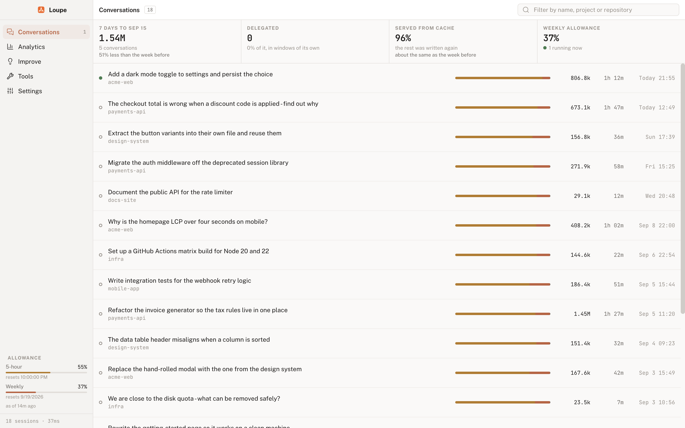
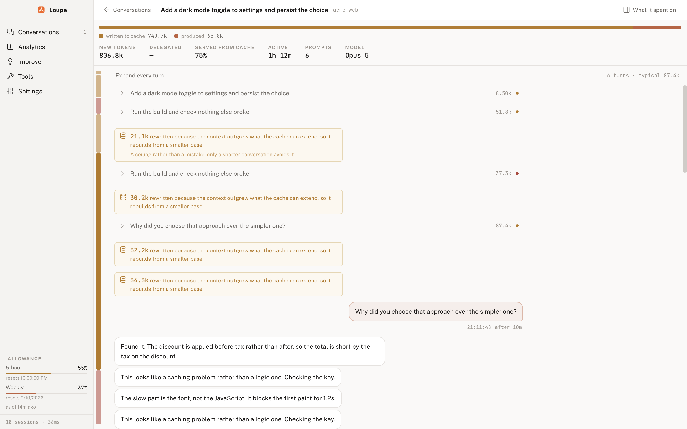
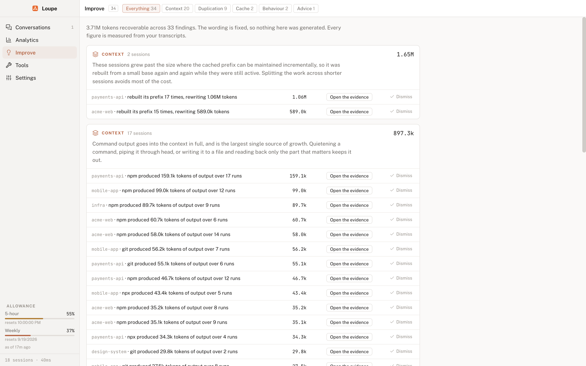

<div align="center">
  
  <h1>Loupe</h1>
  <p><strong>A token inspector for Claude Code - where your context, cache and allowance actually went.</strong></p>
</div>

Loupe reads the transcripts Claude Code writes to your machine and explains
them. Which session burned the tokens, which file got read eleven times, where
the prompt cache was thrown away and rebuilt, and how much of your five-hour
allowance a piece of work actually cost.



## What it tells you

- **Why a turn was expensive**, in one of four words. Cache writes are 85% of
  everything spent, and a single "new tokens" figure cannot tell you whether
  that went on work or on paying twice. Every turn splits into what it re-paid
  after a rebuild, what it added to a growing context, what it produced, and
  what it handed to subagents.
- **What the cache did.** Every point the cached prefix was discarded and
  rebuilt, split by cause - idle expiry, a mid-session model change, a
  compaction, or a prefix that simply moved as the context grew - and drawn in
  the conversation at the turn that paid for it.
- **What was avoidable.** A file read at full length nine times, a file re-sent
  into the context after every edit, a command that failed four times running.
  Every figure is measured from your own transcripts.
- **What it cost you.** Allowance comes from Anthropic's usage endpoint and is
  attributed to the sessions running at the time. It is measured, never
  estimated, so a session that predates installation shows blank rather than a
  guess.
- **What is happening right now.** A running conversation sits at the top of the
  list and keeps updating as it is written, and alerts you when something
  unexpectedly expensive happens.

## Download

Get the latest build from the
[releases page](https://github.com/ashley-hunter/loupe/releases/latest).

Loupe is an Apple silicon macOS app: download `Loupe-<version>-arm64.dmg`.

Builds are signed with a Developer ID certificate and notarised by Apple, so
a downloaded `.dmg` opens with a double click and no Gatekeeper warning.

## Requirements

- Claude Code, with at least one session recorded under `~/.claude/projects`.
- An Apple silicon Mac.

There is no database and no setup. The first launch parses everything it finds
and caches the result, so later launches are instant.

## The screens

**Conversations** is everything, most recent activity first, with whatever is
running at the top. Each row carries the split between what was written to
cache, produced and delegated, so an expensive conversation is visible without
opening it. The filter searches names, projects and repositories; a date from
Analytics narrows it to a day.

**Opening one** gives the conversation itself. Quiet turns collapse to a line
and expensive ones open with a ledger of where their tokens went and a sentence
saying why. Rebuilds, compactions and subagents are drawn in the gap where they
happened rather than filed on another screen, and the spine down the left edge
is a map of spend you can scan and jump through.



**Analytics** answers what a single conversation cannot: whether it is getting
better, whether you will run out, and what is normal for you. Every chart is a
way into Conversations - click a day or a project and the list narrows to it.


**Improve** ranks what is worth changing by what it gives back, and keeps the
advice that carries no token figure clearly apart from the findings that do.



**Tools** is the only part that writes anything: a countdown to the cached
prefix expiring with the break-even for holding it, actions that can run before
it goes, and wake-ups that start a session at a chosen time so the five-hour
block begins where you meant it to.

⌘K opens a command palette; ⌘F jumps to the filter.

## Building from source

Node 22 or newer.

```sh
npm install
npm run dev        # vite dev server plus electron
npm start          # build and run the packaged main process
npm run check      # typecheck, lint, format check, tests
npm run dmg        # an ad-hoc signed dmg in release/
npm run dmg:signed # signed with Developer ID and notarised, see docs/signing.md
```

`npm run check` is what CI runs, and a pre-commit hook runs it on staged files.

## Licence

MIT. See [LICENSE](LICENSE).
